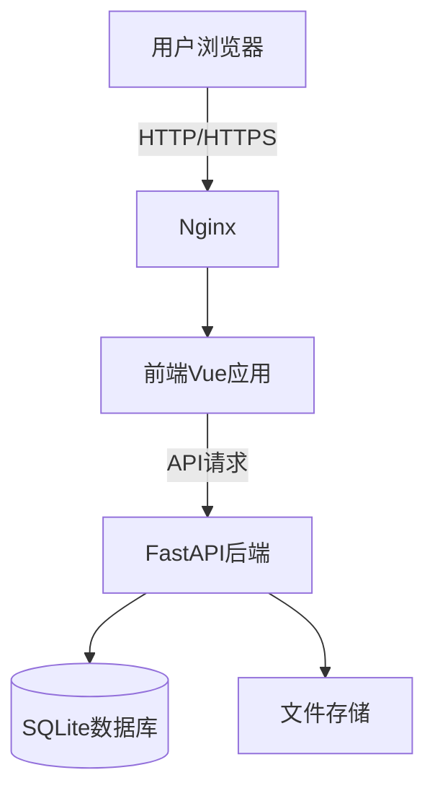

# 数据统计报表系统 - 技术架构文档

## 1. 架构设计

### 1.1 整体架构图



### 1.2 架构风格
采用经典的三层架构模式：
- **表现层**: Vue.js 前端应用
- **业务逻辑层**: FastAPI 后端服务
- **数据层**: SQLite 数据库 + 文件存储

### 1.3 模块划分

| 模块 | 职责 | 技术栈 |
|------|------|--------|
| frontend | 用户界面展示 | Vue 3 + Element Plus |
| backend | API接口服务 | FastAPI + Python |
| database | 数据持久化 | SQLite |
| charts | 图表渲染 | ECharts |

---

## 2. 技术选型

### 2.1 前端技术

| 技术 | 版本 | 用途 |
|------|------|------|
| Vue.js | 3.x | 前端框架 |
| Element Plus | 2.x | UI组件库 |
| ECharts | 5.x | 图表可视化 |
| Axios | 1.x | HTTP请求 |
| Vue Router | 4.x | 路由管理 |

### 2.2 后端技术

| 技术 | 版本 | 用途 |
|------|------|------|
| FastAPI | 0.100+ | API框架 |
| Python | 3.11+ | 编程语言 |
| SQLite | 3.x | 数据库 |
| SQLAlchemy | 2.x | ORM |
| pandas | 2.x | 数据处理 |
| openpyxl | 3.x | Excel处理 |
| python-multipart | 0.0.6 | 文件上传 |

### 2.3 部署技术

| 技术 | 用途 |
|------|------|
| Docker | 容器化 |
| Docker Compose | 编排部署 |
| Nginx | 反向代理 |

---

## 3. 目录结构

```
project/
├── backend/                    # 后端代码
│   ├── app/                   # 应用代码
│   │   ├── main.py            # 入口文件
│   │   ├── models/            # 数据模型
│   │   ├── routers/           # API路由
│   │   ├── schemas/           # 数据结构定义
│   │   ├── services/          # 业务逻辑
│   │   └── utils/             # 工具函数
│   ├── requirements.txt       # 依赖列表
│   └── Dockerfile             # 后端Dockerfile
├── frontend/                  # 前端代码
│   ├── src/
│   │   ├── components/        # 组件
│   │   ├── views/             # 页面视图
│   │   ├── router/            # 路由配置
│   │   ├── store/             # 状态管理
│   │   └── utils/             # 工具函数
│   ├── package.json           # 依赖配置
│   └── Dockerfile             # 前端Dockerfile
├── docker-compose.yml         # Docker Compose配置
└── nginx.conf                 # Nginx配置
```

---

## 4. 关键设计

### 4.1 数据库设计

#### 4.1.1 用户表 (users)

| 字段名 | 类型 | 约束 | 说明 |
|--------|------|------|------|
| id | INTEGER | PRIMARY KEY AUTOINCREMENT | 用户ID |
| username | VARCHAR(50) | NOT NULL UNIQUE | 用户名 |
| password | VARCHAR(255) | NOT NULL | 密码(加密) |
| email | VARCHAR(100) | | 邮箱 |
| role | VARCHAR(20) | DEFAULT 'user' | 角色 |
| created_at | DATETIME | DEFAULT CURRENT_TIMESTAMP | 创建时间 |

#### 4.1.2 数据表 (data_records)

| 字段名 | 类型 | 约束 | 说明 |
|--------|------|------|------|
| id | INTEGER | PRIMARY KEY AUTOINCREMENT | 记录ID |
| category | VARCHAR(50) | NOT NULL | 数据分类 |
| title | VARCHAR(100) | NOT NULL | 标题 |
| value | DECIMAL(18,2) | NOT NULL | 数值 |
| unit | VARCHAR(20) | | 单位 |
| date | DATE | NOT NULL | 日期 |
| remark | TEXT | | 备注 |
| created_by | INTEGER | FOREIGN KEY | 创建人 |
| created_at | DATETIME | DEFAULT CURRENT_TIMESTAMP | 创建时间 |

#### 4.1.3 报表模板表 (report_templates)

| 字段名 | 类型 | 约束 | 说明 |
|--------|------|------|------|
| id | INTEGER | PRIMARY KEY AUTOINCREMENT | 模板ID |
| name | VARCHAR(100) | NOT NULL | 模板名称 |
| config | TEXT | NOT NULL | 配置JSON |
| created_at | DATETIME | DEFAULT CURRENT_TIMESTAMP | 创建时间 |

### 4.2 API接口设计

#### 4.2.1 用户接口

| API路径 | 方法 | 功能 |
|---------|------|------|
| /api/auth/login | POST | 用户登录 |
| /api/auth/logout | POST | 用户登出 |
| /api/users | GET | 获取用户列表 |
| /api/users/{id} | GET | 获取用户详情 |
| /api/users | POST | 创建用户 |
| /api/users/{id} | PUT | 更新用户 |
| /api/users/{id} | DELETE | 删除用户 |

#### 4.2.2 数据接口

| API路径 | 方法 | 功能 |
|---------|------|------|
| /api/data | GET | 查询数据列表 |
| /api/data/{id} | GET | 获取数据详情 |
| /api/data | POST | 创建数据 |
| /api/data/{id} | PUT | 更新数据 |
| /api/data/{id} | DELETE | 删除数据 |
| /api/data/import | POST | 批量导入数据 |
| /api/data/export | GET | 导出数据 |

#### 4.2.3 报表接口

| API路径 | 方法 | 功能 |
|---------|------|------|
| /api/reports/templates | GET | 获取报表模板 |
| /api/reports/templates/{id} | GET | 获取模板详情 |
| /api/reports/templates | POST | 创建模板 |
| /api/reports/generate | POST | 生成报表数据 |
| /api/reports/export/{id} | GET | 导出报表 |

### 4.3 前端页面设计

| 页面 | 路径 | 组件 |
|------|------|------|
| 登录页 | /login | Login.vue |
| 仪表盘 | /dashboard | Dashboard.vue |
| 数据列表 | /data | DataList.vue |
| 数据录入 | /data/add | DataForm.vue |
| 报表中心 | /reports | ReportCenter.vue |
| 用户管理 | /users | UserList.vue |
| 系统设置 | /settings | Settings.vue |

---

## 5. 部署方案

### 5.1 Docker Compose配置

服务组成：
- nginx: 反向代理
- frontend: 前端应用
- backend: 后端API
- 数据库: SQLite（文件挂载）

### 5.2 环境变量

| 变量名 | 说明 | 默认值 |
|--------|------|--------|
| PORT | 服务端口 | 80 |
| DB_PATH | 数据库路径 | ./data/db.sqlite |
| SECRET_KEY | 加密密钥 | 随机生成 |

---

## 6. 安全性考虑

1. **密码加密**: 使用bcrypt加密存储
2. **JWT认证**: 使用JSON Web Token进行接口认证
3. **权限控制**: 基于角色的访问控制(RBAC)
4. **输入验证**: 后端严格验证所有输入数据
5. **文件上传**: 限制文件类型和大小
6. **SQL注入防护**: 使用ORM防止SQL注入
